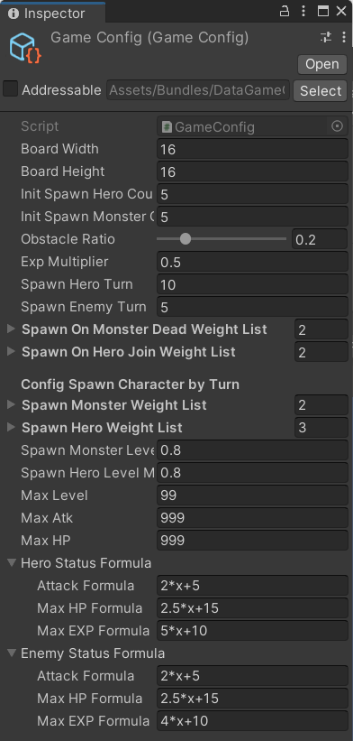
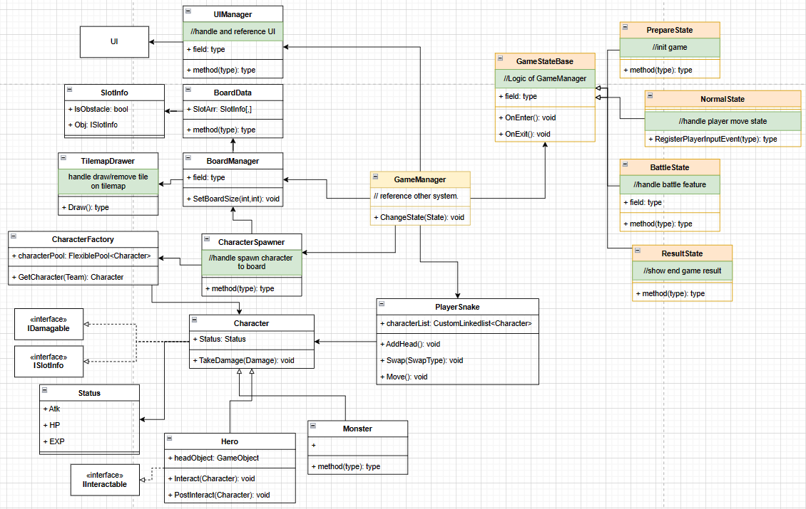

# Game 2D Test

A 2D turn-based strategy game built in Unity. This project is implemented based on [Assignment](./Assignment.md) and [GDD](./GDD.md). No third-party plugins are used.

Contents:

- [How to Run the Project](#how-to-run-the-project)
- [Extra Features](#extra-features)
- [How to Config Game Value](#how-to-config-game-value)
- [Class Diagram](#class-diagram)
- [Technical Decision](#technical-decision)

## How to Run the Project

**Option 1:** [Download and Play](https://drive.google.com/file/d/1Z__xrLDYNwXQD7PEeu7OCxx_P9n00tsq/view?usp=drive_link) (Google Drive — ensure the link is publicly accessible)

**Option 2:** Clone from GitHub
- Open "StartScene" at `Assets/Scenes/StartScene.unity`

## Extra Features

- Character's Level and EXP system.
   - Player will get more EXP if you have more allies when the turn ends.
   - Monster will get more EXP when the turn ends.
   - Character's status increases when the character's level increases.
- Every set number of turns, characters will spawn (configurable).
   - Characters will spawn every 5 turns.
   - Monsters will spawn with a random amount every 10 turns.

## How to Config Game Value

Config file path: `Assets/Bundles/Data/GameConfig.asset`

You can adjust values in the Inspector.

**Note:** `x` in formulas represents the character's level.

## Class Diagram

Full class diagram: [Google Drive](https://drive.google.com/file/d/1GS3m6tgXnBQ4GNG9-y2y1dQ9jqYQwCy_/view?usp=drive_link)

## Technical Decision

[Place Obstacle](document/place-obstacle.md)

[Status Formula](document/status-formula.md)

