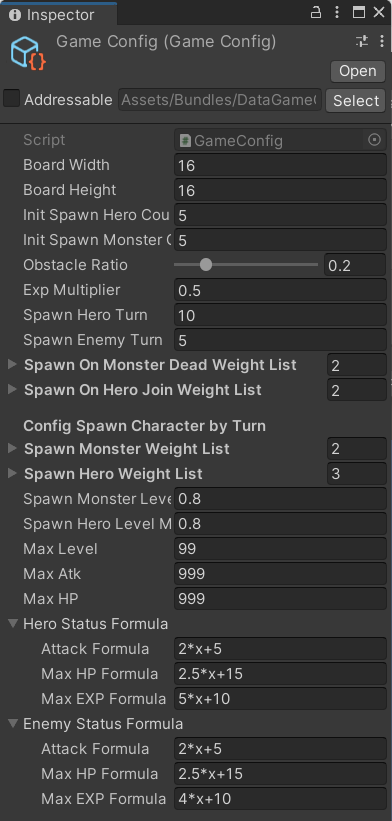

Contents:

- [Extra features](#extra-features)
- [How to config game value](#how-to-config-game-value)
- [Class diagram](#class-diagram)
- [Techinal Decision](#techinal-decision)

## Extra features

- Character's Level and EXP system.
   - Player will get more EXP if you have more allies when the turn ends.
   - Monster will get more EXP when the turn ends.
   - Character's Status increase when character's level is increase.
- Every period of turns. character will spawn (the turn can be config)
   - Character will spawn every 5 turns
   - monster will spawn with a random amount every 10 turns

## How to config game value
Config file path:
Assets/Bundles/Data/GameConfig.asset
You can Adjust on inspector.

## Class diagram

class diagram:
https://drive.google.com/file/d/1GS3m6tgXnBQ4GNG9-y2y1dQ9jqYQwCy_/view?usp=drive_link

## Techinal Decision
[Place Obstacle](document/place-obstacle.md)
